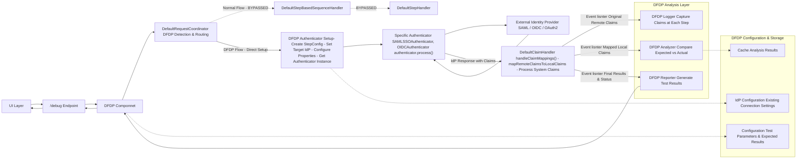

# DFDP Architecture Diagram (Mermaid)

```mermaid
graph LR
   %% UI Layer
   UI[UI Layer] --> DebugEndpoint["/debug Endpoint"]

   %% API Layer
   DebugEndpoint --> DFDPComponnet[DFDP Componnet]

   %% DFDP Core Layer
   %% DFDPController --> DFDPComponnet[DFDP Orchestrator]
   DFDPComponnet --> RequestCoordinator["DefaultRequestCoordinator DFDP Detection & Routing"]

   %% Framework Bypass (Normal Flow - Grayed Out)
   RequestCoordinator -.->|Normal Flow - BYPASSED| StepHandler["DefaultStepBasedSequenceHandler"]
   StepHandler -.->|BYPASSED| DefaultStepHandler[DefaultStepHandler]

   %% DFDP Direct Path - Bypass Normal Flow
   RequestCoordinator -->|DFDP Flow - Direct Setup| DFDPAuthenticatorSetup["DFDP Authenticator Setup- Create StepConfig - Set Target IdP - Configure Properties - Get Authenticator Instance"]

   DFDPAuthenticatorSetup --> SpecificAuthenticator["Specific Authenticator SAMLSSOAuthenticator, OIDCAuthenticator authenticator.process()"]

   %% External IdP Interaction
   SpecificAuthenticator --> ExternalIdP["External Identity Provider SAML / OIDC / OAuth2"]
   ExternalIdP --> SpecificAuthenticator

   %% After IdP Response - Claim Handling
   SpecificAuthenticator -->|IdP Response with Claims| ClaimHandler["DefaultClaimHandler handleClaimMappings() - mapRemoteClaimsToLocalClaims - Process System Claims"]

   %% DFDP Analysis Layer
   subgraph "DFDP Analysis Layer"
       DFDPLogger["DFDP Logger Capture Claims at Each Step"]
       DFDPAnalyzer["DFDP Analyzer Compare Expected vs Actual"]
       DFDPReporter["DFDP Reporter Generate Test Results"]
   end

   %% DFDP Logging Points
   ClaimHandler -->|Event lisnter Original Remote Claims| DFDPLogger
   ClaimHandler -->|Event lisnter Mapped Local Claims| DFDPAnalyzer
   ClaimHandler -->|Event lisnter Final Results & Status| DFDPReporter

   %% Config & Storage
   subgraph "DFDP Configuration & Storage"
       DFDPConfig["Configuration Test Parameters & Expected Results"]
       DFDPCache["Cache Analysis Results"]
       IdPConfig["IdP Configuration Existing Connection Settings"]
   end

   DFDPComponnet -.-> DFDPConfig
   DFDPAuthenticatorSetup -.-> IdPConfig
   DFDPAnalyzer -.-> DFDPCache

   %% Response Flow
   DFDPReporter --> DFDPComponnet --> DebugEndpoint --> UI
```
